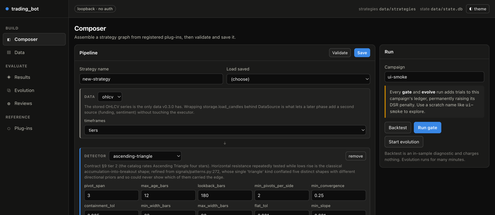
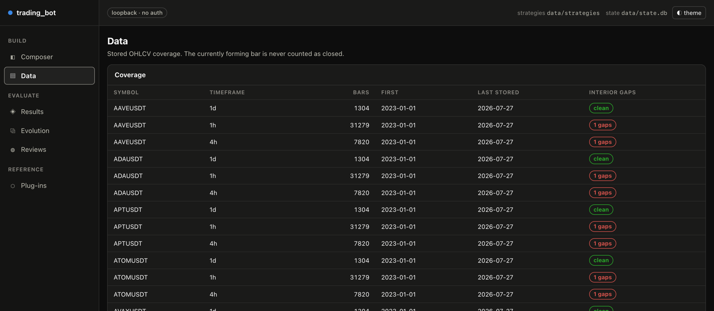
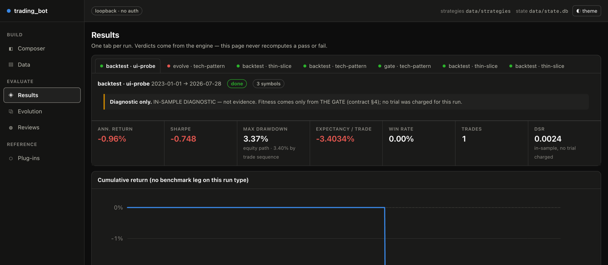
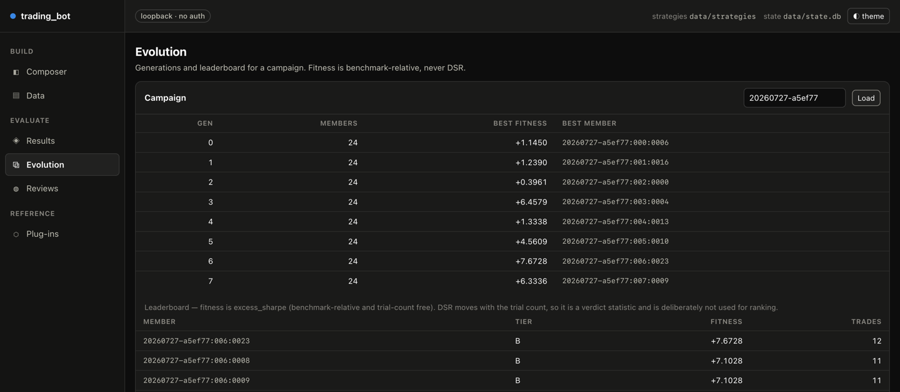
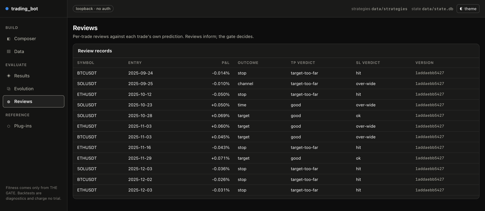
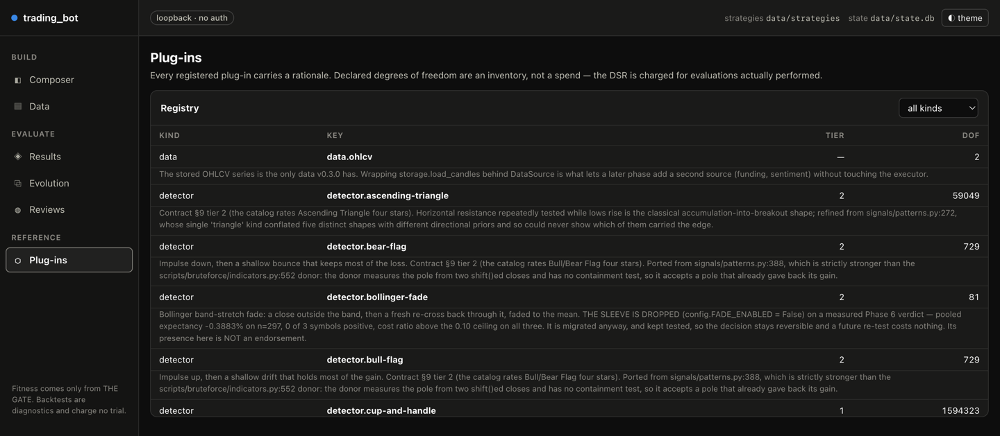

# The builder UI — a visual guide

Screenshots captured 2026-07-28 from the running server at `127.0.0.1:8770`, against the real
`data/ohlcv.db` and `data/state.db`.

```bash
.venv/bin/python -m trading_bot.cli ui
# → http://127.0.0.1:8770
```

---

## Short answer: no, the UI does not cover all nine use cases

It covers **2 of 9 completely**, 5 partially, and 2 not at all. The UI is a *strategy
workbench* — it is excellent at composing a strategy and judging it, and deliberately does
nothing that writes price data or spends the holdout.

| # | Use case (from the [root README](../../README.md)) | In the UI? | What's missing |
|---|---|---|---|
| 1 | Keep price data fresh | **Read-only** | Shows coverage and gaps. **No `backfill`, no `poll`** — CLI only |
| 2 | What would it trade right now | **No** | No `regime` / `signal` view at all |
| 3 | Test over history | **Partial** | `backtest` yes. **No `benchmark`** — so no buy-and-hold null. No legacy non-graph `backtest` |
| 4 | Get an honest verdict (the gate) | **Yes** | — |
| 5 | Build strategies | **Yes — better than the CLI** | Multi-detector graphs yes; genuinely divergent branches stay read-only |
| 6 | Learn from closed trades | **Read-only** | Browses reviews. **No `--register`, no forward-test, no `--loop`** |
| 7 | Search for a better strategy | **Partial** | Starts an evolve run at config defaults. **No `--calibrate`, `--resume`, or population/generation overrides** |
| 8 | Run the pre-registered campaign | **No** | Deliberate — the campaign spends the one-shot holdout |
| 9 | Diagnostics | **Partial** | Plug-in registry yes (richer than CLI) and `graph-validate` via **Validate**. **No `detector-report`, no `correlation-report`** |

The UI can launch exactly **three** run kinds — `backtest`, `gate`, `evolve`
(`ui/api.py:963`). Everything else is CLI.

**Why the gaps are the right ones.** The three things the UI refuses to do are the three that
are hardest to undo: writing to the 117 MB price store, and consuming a holdout that can only
be spent once. Keeping them on the CLI means they cannot happen from a stray click.

---

## 1. Composer — build a strategy



The core of the UI, and genuinely better than hand-editing JSON: **every parameter shows its
declared range and the reasoning behind it**, pulled from the plug-in's own `ParamSpec`.

**Flow.**
1. Name it, or pick an existing one from **Load saved**.
2. The pipeline reads top to bottom: `DATA → DETECTOR… → [CONFIRMATION…] → POLICY → [FILTER…]`.
3. Add stages with **+ detector**, **+ confirmation**, **+ filter**. 20 detectors, 3 policies.
4. **Validate** first — it calls the same graph validation as `cli graph-validate`.
5. **Save** writes `data/strategies/<name>.strategy.json`.

**Several detectors, one strategy.** **+ detector** can be pressed more than once. Each detector
stage becomes its own *branch* sharing the same confirmations, policy, regimes and exits — so
`DETECTOR a` and `DETECTOR b` means "take a's setups OR b's setups, then confirm and size them
the same way". The branch machinery was always in the graph model; before v0.3.1 only the
composer refused to emit more than one.

**Evolution eligibility.** Below the pipeline, a checkbox per registered detector controls which
detectors evolution is allowed to swap in or add as a new branch. Unchecking one closes that
door for every generation of the campaign. Two things worth knowing:

- Detectors already in the pipeline are checked and disabled — the UI will not let you express
  "the seed uses X but evolution may not". That combination would starve the mutator.
- Leaving everything checked stores **no constraint at all**, so a strategy you never touched
  saves byte-identically to before this feature existed. The constraint rides in `graph.meta`,
  which is excluded from the content hash — so changing eligibility does not fork the strategy's
  identity or orphan its ledger rows.

Evolution may still *drop* a detector that is already in the graph even if you uncheck it:
"do not explore this" is not the same instruction as "never shed this".

**The Run panel** (right) is where work starts, and it is honest about cost:

| Button | Charges a trial? | Notes |
|---|---|---|
| **Backtest** | No | In-sample diagnostic |
| **Run gate** | **Yes** | Adds to the campaign ledger permanently |
| **Start evolution** | **Yes, many** | Runs for many minutes |

**Set the Campaign field to a scratch name** (the UI suggests `ui-smoke`) before exploring.
Every gate and evolve run adds trials to that campaign's ledger, permanently raising its DSR
penalty — the UI says so inline, and it is not decoration. A campaign name is *required* for
gate and evolve runs, because every ledger row must be attributable.

**Gotchas.**
- Only **uniform** graphs are editable — every branch agreeing on policy, confirmations (same
  keys, same order), regimes and exits. A multi-detector strategy composed here satisfies that by
  construction. Graphs whose branches genuinely diverge go read-only rather than being silently
  flattened, and a save that would discard branches is refused with HTTP 409. `donchian-v020`,
  `thin-slice` and `thin-slice-noconfirm` (2 branches each) all diverge and stay read-only;
  `tech-pattern`, `tech-pattern-double-confirmations` and `cup-and-handle` are editable.
- Evolve runs at **config defaults** (population 24 × 8 generations) on the frozen training
  span. There is no override in the UI — for `--calibrate`, `--resume`, or a different size,
  use the CLI.
- Some decimal parameter boxes render with the browser's "invalid" styling even at their
  default value (a `step` attribute artifact). Validate is the authority, not the outline.

## 2. Data — coverage, read-only



Per symbol and timeframe: bar count, first and last stored bar, and an interior-gap badge.
**The currently forming bar is never counted as closed** — which is exactly the partial-bar
trap the CLI guide warns about, handled correctly here.

Useful before any run: if a series is short or gappy, every downstream number inherits that.

**You cannot fix anything from this page.** There is no backfill button. When you see gaps:

```bash
.venv/bin/python -m trading_bot.cli backfill --symbol <SYM> --timeframe <TF>
```

**Observed right now:** every `1h` and `4h` series reports **1 gaps** while every `1d` series is
clean. Worth investigating before trusting intraday-tier results.

## 3. Results — one tab per run



Annualized return, Sharpe, max drawdown, expectancy per trade, win rate, trade count, DSR —
plus a cumulative-return chart. Tabs persist across restarts (backed by `data/ui_runs/`), with a
coloured dot for run state.

The framing is the point: **"Verdicts come from the engine — this page never recomputes a pass
or fail."** A backtest tab is stamped *"IN-SAMPLE DIAGNOSTIC — not evidence"* and reports
`DSR … in-sample, no trial charged`.

**Gotchas.**
- The chart header says **"no benchmark leg on this run type"** for backtests. **The UI will not
  tell you whether you beat buy-and-hold.** That is the single most important comparison in this
  project, and it is CLI-only: `cli benchmark --start … --end …`.
- A single-trade run still renders a full metric grid. Read `TRADES` before anything else — the
  example above is 1 trade, so every other figure on it is noise.

## 4. Evolution — generation browser and trade replay



> **The screenshot above predates v0.3.1** and shows the old table-only view. The layout is now a
> sidebar plus an animated replay chart, described below; the **Table** toggle still renders
> exactly what the screenshot shows. Recapture per "Keeping these screenshots honest".

Pick a campaign in the sidebar. It lists each generation with its best fitness; expanding one
lists that generation's members (`#index`, role, tier chip, fitness). The old table did not let
you ask the one question that matters — *what does this member actually do?* — so the main pane
now answers it.

**Replay.** Click a member and its evaluation window plays back bar by bar on a candlestick
chart, over the exact frozen `window_start_ms … window_end_ms` the campaign scored it on. As the
cursor reaches each trade you get a shaded pattern zone, an entry marker (▲ long / ▼ short), and
dashed entry / stop / target lines running to the exit bar, with an exit marker coloured by
outcome. The panel underneath shows the open position (direction, `pattern`, entry,
stop, target, `planned_rr`) or, between trades, the running totals so far.

Controls: play/pause, speed (1× / 4× / 16×), a scrub bar, and ⏮ to reset. Symbol and timeframe
selectors re-fetch the same member against different data.

**This is a re-derivation, not a re-run.** The replay endpoint re-executes the member's own graph
over its own frozen window to recover the trades the campaign already scored. It never calls the
oracle, never charges a trial, and never writes to `state.db` or the trial ledger — so you can
scrub a member as many times as you like without moving a single number. A member that was never
scored, or that errored during evaluation, has no window to replay and says so rather than
showing an empty chart.

**What the numbers still tell you.** The real Phase 6 campaign `20260727-a5ef77` (24 × 8)
**illustrates the documented design flaw better than prose can**: the best member of generation 6
scores fitness **+7.6728 on 12 trades**, and the whole leaderboard top is 11–12 trades against a
gate floor of 30. Fitness is `excess_sharpe`, which rewards not trading. DSR moves with trial
count, so it is a verdict statistic and deliberately not used for ranking. Replay makes this
concrete: stepping through a high-fitness member shows you exactly how few times it fires.

To find campaign ids:

```bash
.venv/bin/python -c "import sqlite3;print([r[0] for r in sqlite3.connect('data/state.db').execute('select campaign_id from campaigns')])"
```

## 5. Reviews — per-trade, against its own prediction



Each closed trade with entry date, P&L, exit outcome (`stop` / `target` / `time` / `channel`),
and separate **TP verdict** and **SL verdict** — `good`, `target-too-far`, `over-wide`, `hit`,
`ok`. The header states the rule the whole layer obeys: *reviews inform; the gate decides.*

The pattern in the rows above reads immediately: `target-too-far` pairs with `stop` exits and
losses, `good` pairs with `target` exits and gains.

**Read-only.** Registering a version, forward-testing, and the refinement loop are CLI:
`cli review --strategy … --register`.

## 6. Plug-ins — the registry, with rationale



Every registered plug-in with its kind, key, catalog tier, declared degrees of freedom, and a
paragraph explaining **why it exists and where it came from**. Filterable by kind.

This is strictly more informative than `cli plugins`. Two examples visible above:
- `detector.bollinger-fade` states outright that its sleeve is **dropped**
  (`FADE_ENABLED = False`) on a measured verdict, and that "its presence here is NOT an
  endorsement."
- `detector.bear-flag` records that it is stronger than the bruteforce donor it replaced, and
  why.

The DoF column is an **inventory, not a spend** — the header says so. `detector.cup-and-handle`
declares 1,594,323 combinations; that costs nothing until something searches them.

---

## A minimal end-to-end flow in the UI

1. **Data** → confirm the symbols you care about are clean.
2. **Composer** → Load `tech-pattern` (the editable one), or build from scratch.
3. Set **Campaign** to a scratch name like `ui-smoke`.
4. **Validate** → **Save**.
5. **Backtest** → **Results**. Check `TRADES` first, then the rest.
6. Drop to the CLI for the null: `cli benchmark --start 2023-07-27 --end 2026-07-27`.
7. Only if the backtest is interesting: **Run gate**. It costs a trial, permanently.
8. **Results** → read the gate verdict. Never re-run to get a nicer number.

---

## Safety properties, verified in the code

- **Loopback only, no auth.** `ui/server.py` refuses a non-loopback host with no override flag.
- **One heavy run at a time.** `MAX_TIER_A_JOBS = 1`; a second backtest or gate returns HTTP 429.
- **No shell injection.** Evolve runs spawn via `Popen` with an argv **list** and `shell=False`,
  so no request value is ever interpolated into a shell string.
- **Symbols are allow-listed** against what is actually stored; an unknown symbol is a 400.
- **The holdout is unreachable from the UI.** Evolve is launched without `--train-start` /
  `--train-end`, so it inherits the frozen, holdout-safe span from config.
- **Body size capped** at 1 MiB.

## Fixed while writing this guide

The Evolution table rendered **GEN** and **BEST MEMBER** as `—` for every row. `app.js` read
`g.generation` and `g.best_member`, but `/api/generations` emits `gen_index` and
`best_member_id` (the names the `generations` table itself uses, and the ones the tests assert).
Two field names; the screenshot above is the corrected render. Test suite unchanged at 1252
passed, 2 deselected.

## Keeping these screenshots honest

They are downscaled to 1440 px and will go stale when the UI changes. To refresh, start the UI
and recapture at the same six routes: `#compose`, `#data`, `#results`, `#evolution` (load a
campaign first), `#reviews`, `#plugins`.

**Stale as of v0.3.1 — two need recapturing:**

| Shot | Why it is stale |
|---|---|
| `01-compose.png` | Predates the repeatable **+ detector** flow and the eligibility panel |
| `04-evolution.png` | Predates the sidebar and replay chart; shows the Table toggle's content only |

The prose in §1 and §4 describes the current UI; where the two disagree, believe the prose.
